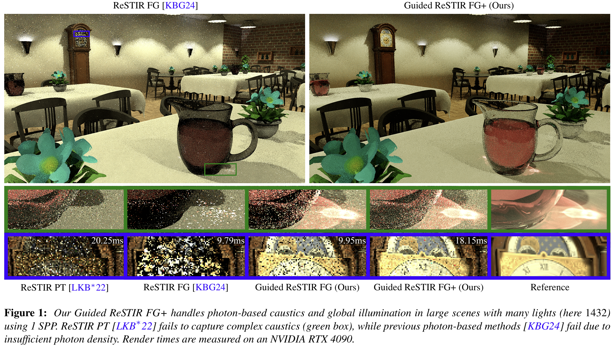

# Guided ReSTIR FG+: Photon Resampling for Large Scenes and Many Lights

## Introduction
This repository contains the source code and an interactive demo for the upcoming EGSR paper:

> **[Guided ReSTIR FG+: Photon Resampling for Large Scenes and Many Lights](https://diglib.eg.org/items/f4bbd38a-fda9-4c43-afc9-dd31e3c5eec1)**  
> René Kern, Felix Brüll, Jonas Kastning, Thorsten Grosch  
> TU Clausthal

This prototype contains the implementation of Guided ReSTIR FG+, an efficient real-time global illumination algorithm that renders caustics in large scenes with many light sources.

This project was implemented using NVIDIA's Falcor rendering framework. See [README_Falcor.md](README_Falcor.md) for the readme provided with Falcor.

You can download the executable demo from the [Releases Page](https://github.com/TU-Clausthal-Rendering/Guided-ReSTIR-FG-Plus/releases/latest), or build the project by following the instructions in [Building Falcor](#building-falcor) or the build instructions in the original [readme](README_Falcor.md).

#### Supplemental Video:

## Contents:

* [Supplemental Resources](#supplemental-resources)
* [Other Resampling Algorithms](#other-resampling-algorithms)
* [Demo usage](#demo-usage)
* [Testing with more Scenes](#testing-with-more-scenes)
* [Falcor Prerequisites](#falcor-prerequisites)
* [Building Falcor](#building-falcor)
* [Contact](#contact)

## Supplemental Resources
In addition to the [supplemental video](https://youtu.be/UZ3_TiyZPmA), we provide comparison videos for each scene using identical camera paths, as well as a [15-second equal-time comparison](https://youtu.be/EnGDO9XE8cM).

The following camera paths compare ReSTIR PT, (unguided) ReSTIR FG, Guided ReSTIR FG, and Guided ReSTIR FG+.

#### Kitchen:

#### Corridor:

#### Hotel:

#### Block Castle:

## Other Resampling Algorithms
In addition to our algorithm, the reposiory and demo provides an implementation of [ReSTIR FG (Lite)](https://github.com/TU-Clausthal-Rendering/ReSTIR-FG) with our guiding approach.

Implementations of ReSTIR PT and the full (non-Lite) version of ReSTIR FG will be added soon.

## Demo usage
The demo contains all four test scenes.
After downloading the demo from the [releases page](https://github.com/TU-Clausthal-Rendering/Guided-ReSTIR-FG-Plus/releases/latest), run `StartDemo.bat` and select the desired scene. 

To test additional scenes that are not included with the demo, see the [Testing with more Scenes](#testing-with-more-scenes) section.

To change the rendering algorithm, use the `Active Graph` drop-down menu at the top of the UI window. Note that selecting an algorithm allocates the memory required for that algorithm.
For more information about a setting, hover over the `(?)` icon.

Controls:
- `WASD` - Camera movement
- `Left Click` + `Mouse movement` - Change camera direction
- `Shift` - Speed up camera movement
- `Q, E` - Camera Down / UP
- `P` - Opens the profiler that shows the Rendertime for each Pass ('ShadowPass' is ours).
- `F9` - Opens the time menu. Animation and camera path speed can be changed here (Scale).
- `F6` - Toggels Graphs UI menu (Enabled by default)

## Testing with more Scenes
Testing with other scenes is possible, however, you may encounter unintended behaviour. The following points should be noted when loading other scenes:
- A scene can be loaded in Mogwai with `File->Load Scene`.
- Guided ReSTIR FG+ supports emissive materials and analytic point/spot lights. Photons are not distributed from environment maps or directional lights.
- The scene currently need to have more than 1 light, this will be fixed in soon.

Falcor supports a variety of scene types:
- Falcor's `.pyscene` format ([more details](docs/usage/scene-formats.md))
    - e.g. [NVIDIA ORCA](https://developer.nvidia.com/orca)
- GLTF
    - Brightness of emissive materials may need to be adjusted.
- FBX
    - Often need manual adjustments for emissive and glass materials.
- Many PBRT V4 files:
    - e.g. [Benedikt Bitterli's Rendering Resources](https://benedikt-bitterli.me/resources/) or [PBRTv4 scenes repo](https://github.com/mmp/pbrt-v4-scenes)
    - May require manual adjustments of materials, as not all materials match Falcor's material model.

## Falcor Prerequisites
- Windows 10 version 20H2 (October 2020 Update) or newer, OS build revision .789 or newer
- Visual Studio 2022
- [Windows 10 SDK (10.0.19041.0) for Windows 10, version 2004](https://developer.microsoft.com/en-us/windows/downloads/windows-10-sdk/)
- A GPU which supports DirectX Raytracing, such as the NVIDIA Titan V or GeForce RTX
- NVIDIA driver 466.11 or newer

Optional:
- Windows 10 Graphics Tools. To run DirectX 12 applications with the debug layer enabled, you must install this. There are two ways to install it:
    - Click the Windows button and type `Optional Features`, in the window that opens click `Add a feature` and select `Graphics Tools`.
    - Download an offline package from [here](https://docs.microsoft.com/en-us/windows-hardware/test/hlk/windows-hardware-lab-kit#supplemental-content-for-graphics-media-and-mean-time-between-failures-mtbf-tests). Choose a ZIP file that matches the OS version you are using (not the SDK version used for building Falcor). The ZIP includes a document which explains how to install the graphics tools.
- NVAPI, CUDA, OptiX (see below)

## Building Falcor
Falcor uses the [CMake](https://cmake.org) build system. Additional information on how to use Falcor with CMake is available in the [CMake](docs/development/cmake.md) development documetation page.

### Visual Studio
If you are working with Visual Studio 2022 or 2026, you can setup a native Visual Studio solution by running `setup_vs2022.bat` or `setup_vs2026.bat` after cloning this repository. The solution files are written to `build/windows-vs2022` or `build/windows-vs2026` and the binary output is located in `build/windows-vs2022/bin` or `build/windows-vs2026/bin`.

## Contact

If you have any questions about the paper, the implementation, or encounter any issues while using this repository, please feel free to get in touch.

Email: rene.kern@tu-clausthal.de
